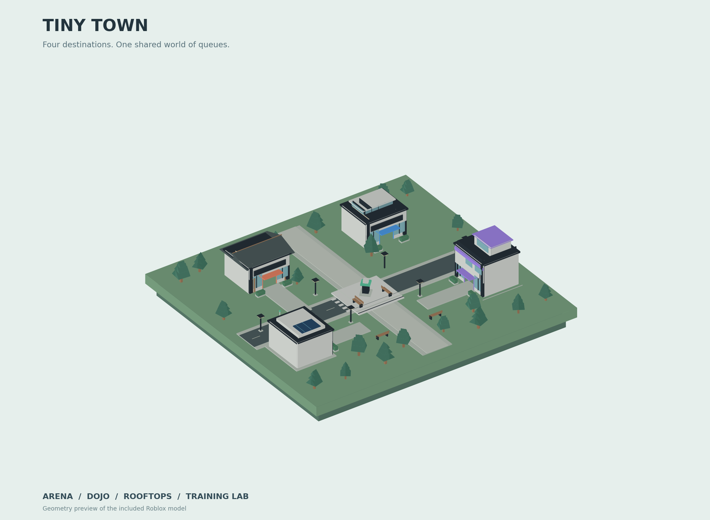

# Tiny Town

A standalone Roblox town lobby. Four modern low-poly buildings each connect to
their own cross-server queue and a different published destination place.

The previous battlegrounds project has been replaced completely. This project
contains the lobby, its interface and matchmaking; destination gameplay belongs
in your four destination places.

| Building | Look | Default departure group |
| --- | --- | --- |
| Arena | Blue glass station with a floating roof | 2–8 players |
| Dojo | Coral entrance, timber accents and angular roof | 2 players |
| Rooftops | Lavender apartment with a planted terrace | 2–6 players |
| Training Lab | Mint entrance, solar panels and antenna | 1–6 players |

All geometry is original Roblox Parts and WedgeParts. The town includes a plaza,
sculpture, roads, crosswalks, benches, trees, streetlights and open interiors.
The checked-in town model appears in Studio's edit view after Rojo sync.



## Open and preview

1. Pull this repository on your PC: `git pull --ff-only origin main`.
2. Open a **new Baseplate place** in Roblox Studio for this standalone project.
3. Run `rojo serve default.project.json` from this repository.
4. Connect the Rojo plugin to port **34872**, review the sync, then accept it.
5. Press **Play**. Walk into any building and onto its colored queue pad.

The default Baseplate is removed at runtime. The town has its own ground and
spawn. This project should be synced into a fresh place to avoid old Studio-only
scripts or map objects from another project.

Studio preview is enabled by default. It uses an in-memory queue, permits solo
previews, shows the departure countdown, then returns you to an idle queue. It
does **not** perform a real teleport or share queues with other Studio instances.
The client clearly labels this mode **STUDIO / LOCAL PREVIEW**.

## Turn on live departures

Read [docs/SETUP.md](docs/SETUP.md). You must publish the lobby and create four
different destination places in the same Roblox experience. Put their **Place
IDs** in `src/ReplicatedStorage/TownShared/TownConfig.lua`. All IDs start at `0`
because none were supplied. Until configured, live entrances show **Opening
soon**, while the Studio preview remains usable.

## Controls

- Walk onto a queue pad to join automatically, or use the entrance prompt.
- **E / gamepad X / touch prompt:** join the nearby building's queue.
- **M / gamepad Y / Destinations button:** open the destination directory.
- Choose a directory card to mark its building. If already nearby, it joins.
- **Leave button / gamepad B:** cancel before the teleport starts.
- After cancellation, step off the pad and back onto it to join again.

The interface supports mouse, touch, gamepad selection, safe screen insets and
viewport resizing. Movement and camera controls use Roblox's standard controls.

## How the queues work

Each destination has a bounded atomic `MemoryStoreHashMap` state shared by all
lobby servers in the experience. Tickets are ordered by join time. Once the
minimum is met, the queue waits up to 12 seconds for more players; a full group
can leave immediately. One server atomically claims the group, reserves one
server, then commits that reserved server's access code for every source lobby
to consume. Each lobby teleports its own players to that same code.

Heartbeats remove disconnected tickets. Reservation leases recover crashed
coordinators. Cancellation uses session IDs so an old request cannot remove a
new ticket. Teleport failures retry the same reserved server up to three times.
Queue callbacks have no API calls or other side effects, so they can be replayed
safely by `UpdateAsync`. Reservation codes stay in server state.

This intentionally bounded implementation admits **48 active tickets per
destination** and **4 active departure groups**. It rejects excess admission
with an honest full-queue message. Do not remove these limits without changing
the storage design: MemoryStore items have size and request quotas. Large-scale
matchmaking needs sharded tickets/assignments and capacity/load testing.

## Source

- `src/Workspace/TinyTown.rbxmx` — Rojo-managed town, visible before Play.
- `scripts/build_town.py` — reproducible geometry generator (standard Python).
- `src/ReplicatedStorage/TownShared/TownConfig.lua` — names, colors, place IDs and group sizes.
- `src/ServerScriptService/Town/QueueState.lua` — pure atomic queue transitions.
- `src/ServerScriptService/Town/QueueService.lua` — services, admission and teleports.
- `src/ServerScriptService/Town/WorldService.lua` — prompts, signage, spawn and walk-in pads.
- `src/StarterPlayer/StarterPlayerScripts/TownClient.client.lua` — responsive interface and markers.

## Verification

```sh
python3 scripts/build_town.py
luau tests/queue_state.spec.lua
rojo build default.project.json -o build/tiny-town.rbxlx
```

The deterministic tests cover queue ownership, competing coordinators, FIFO,
capacity, cancellations, stale sessions, leases and callback replay. Teleports
and real cross-server behavior must also be tested in the published Roblox app;
Studio does not support real TeleportService playtesting.
